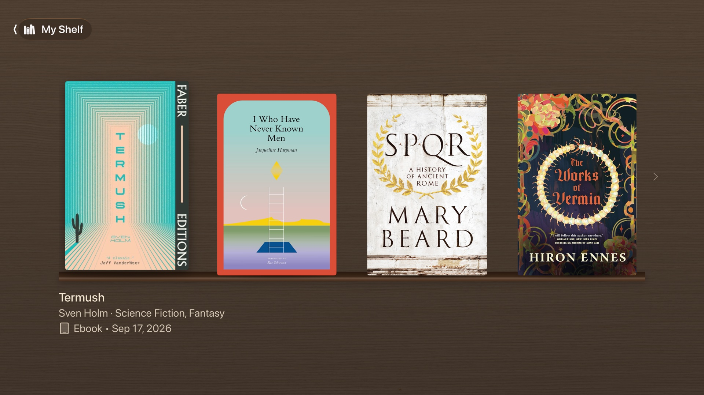
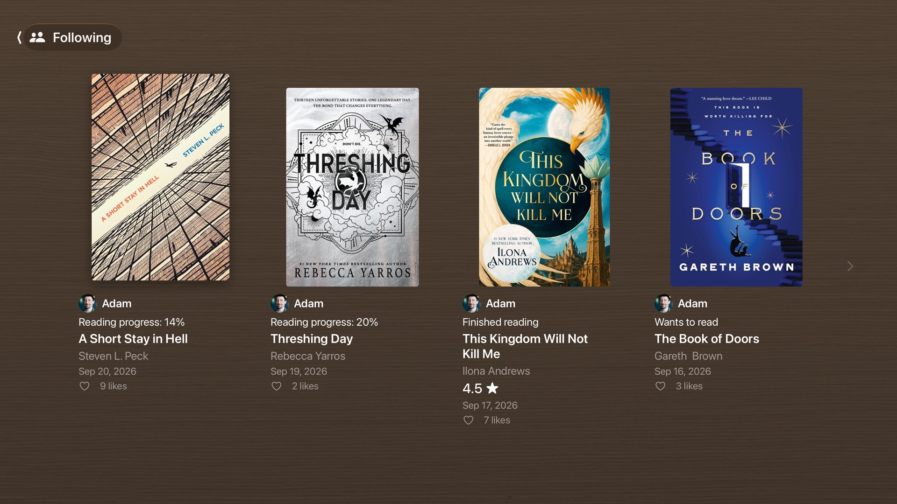
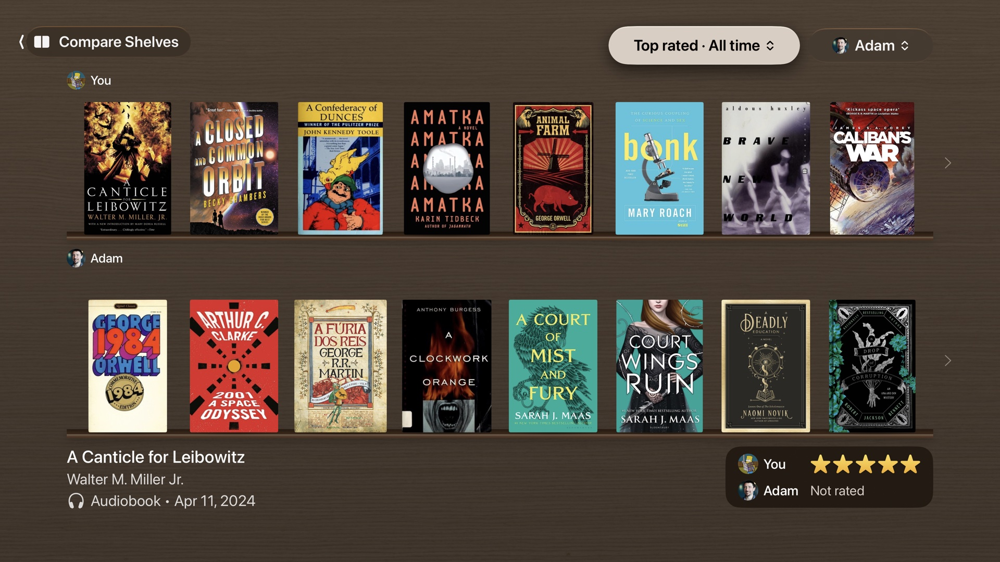
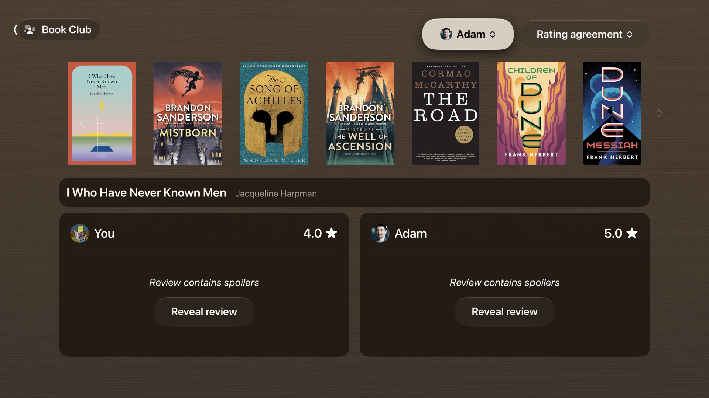

# Bookworms for Apple TV
*e-reading doesn't have to be antisocial*

Bookworms for Apple TV is a beautiful app that helps make e-reading more social IRL.

Bookworms displays your digital library and reading activity on the big screen. In leiu of a bookshelf guests can snoop the spines of, they can look at your TV when it's not in use.

Bookworms also supports comparing your reading activity and history with a user your follow on Hardcover, so you can compare each other's top rated reads, book reviews, and ~~argue~~ talk about your reading tastes.

Currently, Bookworms can pull data from Hardcover and Calibre Web Automated.

Goodreads and StoryGraph prefer to hoard your reading data to themselves. However, you can [import data from those apps to Hardcover](https://hardcover.app/pages/faq).

Bookworms has views for:

* Your most recent reads
* Recent updates from users on Hardcover
* "Side-by-side" comparison of your book library with another user
* Written review comparison of your Hardcover reviews with another user's

Bookworms has an OLED-aware Ambient mode that dims the screen and cycles through selected views on a schedule you choose.

## Screenshots

My Shelf

Following

Compare Shelves

Book Club

Photo credits:
* Gold frame: [ohamina - Magnific.com](https://www.magnific.com/free-psd/elegant-gold-ornate-picture-frame_409112548.htm#fromView=keyword&page=1&position=2&uuid=ff7f9ec6-72b7-402c-81cb-047760d51bf3&track=ais_hybrid&query=Gold+frame+template)
* `WalnutWood`: [Black Walnut Veneer 01](https://polyhaven.com/a/black_walnut_veneer_01).
* `OakWood`: [White Oak Veneer](https://polyhaven.com/a/white_oak_veneer).