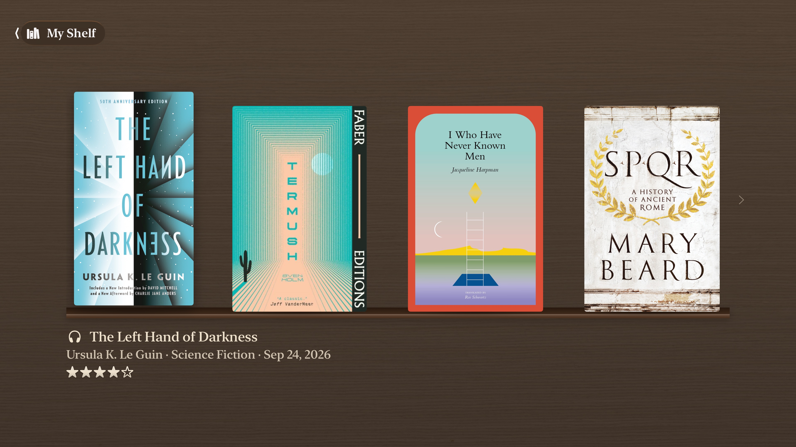
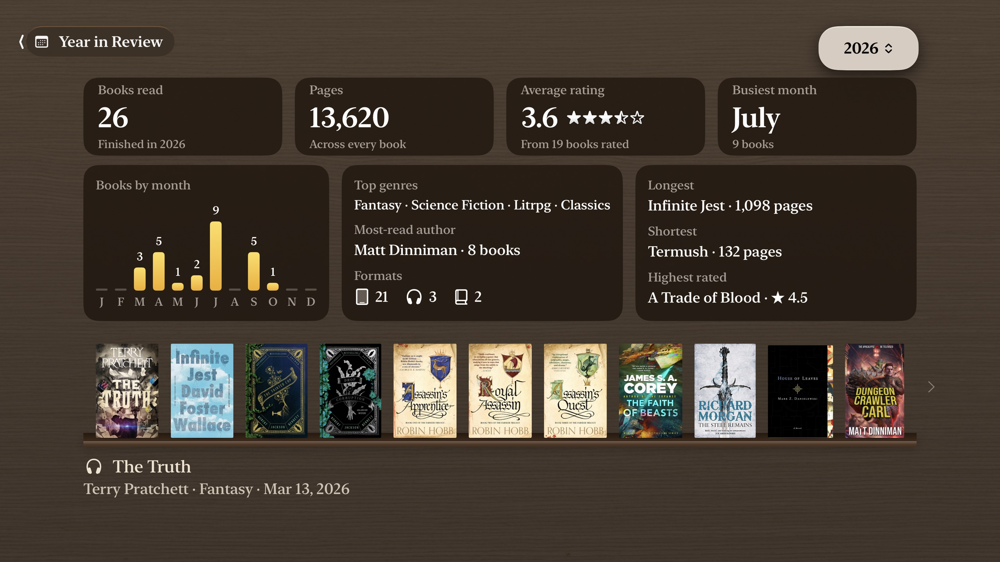
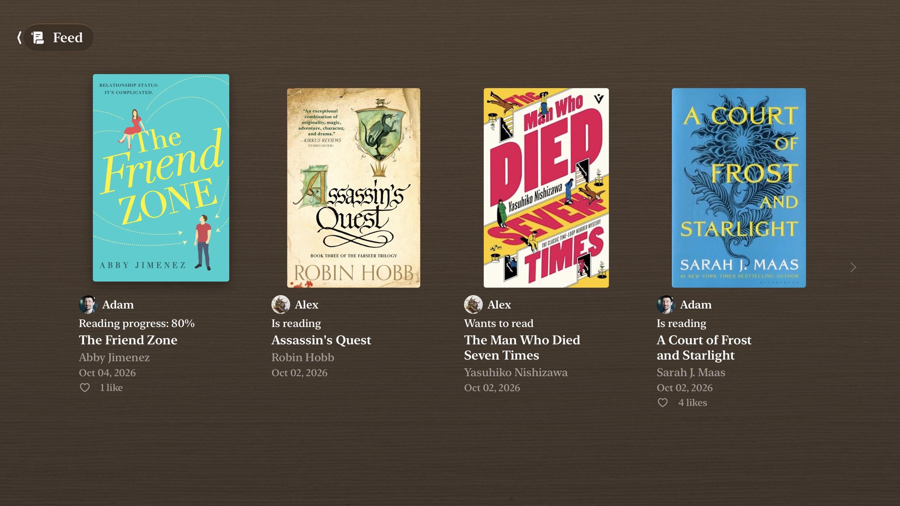
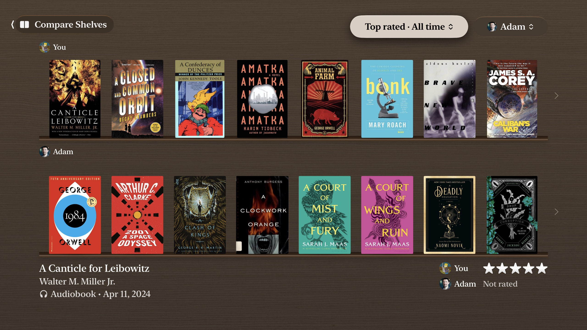
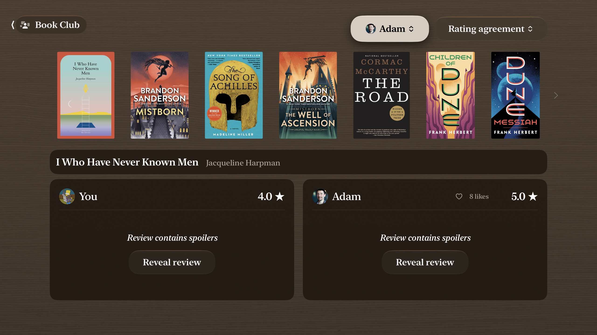
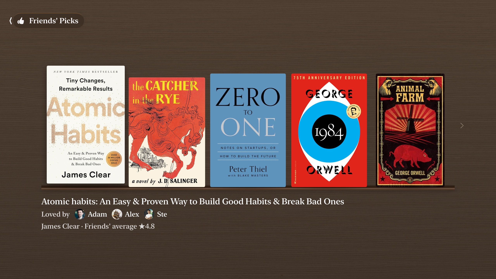

# Bookworms for Apple TV
*e-reading doesn't have to be antisocial*

Bookworms for Apple TV is a beautiful app that helps make e-reading more social IRL.

Bookworms displays your digital library and reading activity on the big screen. In leiu of a bookshelf guests can snoop the spines of, they can look at your TV when it's not in use.

Bookworms also supports comparing your reading activity and history with a user your follow on Hardcover, so you can compare each other's top rated reads, book reviews, and ~~argue~~ talk about your reading tastes.

Currently, Bookworms can pull data from Hardcover and Calibre Web Automated.

Goodreads and StoryGraph prefer to hoard your reading data to themselves. However, you can [import data from those apps to Hardcover](https://hardcover.app/pages/faq).

Bookworms also has an OLED-aware Ambient mode that dims the screen and cycles through selected views on a schedule you choose.

## Screenshots

My Shelf

Year in Review

Feed

Compare Shelves

Book Club

Friends' Picks

Book details

